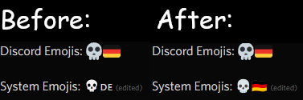

# BetterDiscordFont
CSS to revert Discord's font change and use Noto Emoji Color instead of your system's Emojis. Compatible with [BasicBackground](https://mwittrien.github.io).

## Installation
### Both Patches
(can be quickly disabled and enabled)
1. Install the `BDF-ALL.css` file (Either Local or Online Theme)
2. Install Noto Color Emoji
    1. Download [Noto Color Emoji](https://fonts.google.com/noto/specimen/Noto+Color+Emoji)
    2. Unzip and/or Open
    3. Copy "NotoColorEmoji-Regular.ttf" and put it in the same directory/folder as the theme/css
3. That's it. If you want to enable or disable the patches, open the `BDF-ALL.css` in your text editor.

### One of both Patches
(A bit harder but you'll get the same result)
1. Install the `BDF-ROOT.css` file (Either Local or Online Theme)
2. Install one of the patches
    - Emoji
        1. Install `BDF-EMJ.css` **(Local Theme Only)**
        2. Download [Noto Color Emoji](https://fonts.google.com/noto/specimen/Noto+Color+Emoji)
        3. Unzip and/or Open
        4. Copy "NotoColorEmoji-Regular.ttf" and put it in the same directory/folder as the theme/css
    - Old Discord Font
        1. Install [OldDiscordFont](https://github.com/Overimagine1/old-discord-font/blob/main/source.css) by Overimagine1 (Either Local or Online Theme)
3. That's it.

## Notes
- The `archive` contains the old version of this theme, as I deleted the old repo.
