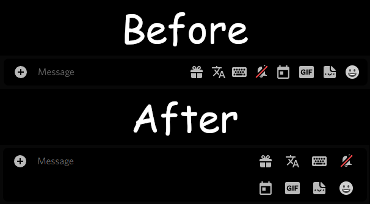

# Condensed Chat Icons
So many plugins put their silly little icon in this already dense spot. On a 4:3 monitor that is straight up hell!
It literally feels like typing on a mobile phone, every 5 words it wraps to the next line.

This Theme fixes that by wrapping the icons. The Chat Field may be taller now, but who cares, at least you can type normally.

## Customizable Values
Name | Value | Description
-|-|-
--min-width-of-text-area | [\<length\>](https://developer.mozilla.org/en-US/docs/Web/CSS/length), eg. 60%, 480px, 24em | This controls how large the input field must be at the very minimum. Using a percentage is recommended as it guarantees uniform behaviour across different screen sizes. If not given, the input field for your message will be ~8px in width.

## Screenshots
