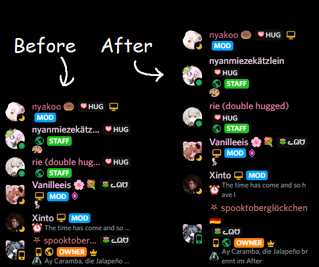

# Full Text
Discord often truncates the text of many Elements (channels, usernames, etc.), this disables that and wraps text accordingly.

Currently affected are: All Member "lists" (DMs and Server Lists), Bio of Profile Popouts, Channels. Users will now have their Name and their Status fully visible in your DM and Server lists.

## Customizable Values
*None*

## Screenshots
