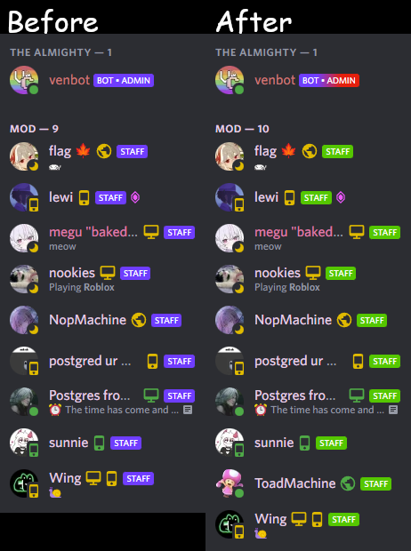

# MoreTagColors (for Vencord)
Makes Bot/Admin/Staff Tags colorful.
I made it to work with Vencord, however it may work with other things as well, if the implementation is the EXACT same.

## Customizable Values
All have a Value of [\<color\>](https://developer.mozilla.org/en-US/docs/Web/CSS/color_value).
All Change the Color of the given Label. Just read the name and you'll figure out which one is for which.
As for `---tags-extra-col`... just keep it as is, you won't see it anyways.